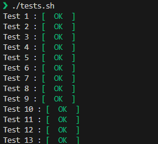

# Droid Combat Radar API

A REST API for the New Republic's YVH combat droid targeting system, processing enemy targets using dynamic protocols and maintaining audit logs. Built with Express, TypeScript, and MongoDB.

## Development Approach:

This project was approached with a focus on extensibility, maintainability, and testability, while avoiding over-engineering for the given scope.
- The application is structured using a layered architecture to separate concerns (API, application logic, data access, etc.), promoting modularity and maintainability.
- Zod schemas are used for comprehensive input validation at the API layer.
- A combination of **unit tests** (for individual protocol logic) and **integration tests** (for API endpoints and database interactions) are included.  The tests cover the acceptance criteria outlined in the original task description, ensuring the core targeting logic and audit system function correctly. An in-memory MongoDB server is used for integration tests to provide isolation and speed up test execution.
- The application is Dockerized for easy deployment and consistent environments.

## Acceptance criteria


## Quick Start

### Recommended: Using Docker (Easiest Method)

The fastest way to get started is using Docker, which handles all dependencies including MongoDB:

```bash
docker compose up --build
```

The API will be available at `http://localhost:3000` with a configured MongoDB instance.

**Note:** Environment variables are preconfigured for Docker in `docker-compose.yml` (adjust accordingly).

## Running Locally

### Prerequisites

- Node.js v20+
- MongoDB 6+
- Docker (optional)


1. **Database Setup**
   - Make sure MongoDB is running locally (if not using Docker)
   - Default connection URL is `mongodb://localhost:27017/droid_db`
   - You can modify the connection URL in `.env.dev`:
     ```bash
     MONGO_URI=mongodb://localhost:27017/droid_db
     ```

2. **Start the Application**
   ```bash
   # Install dependencies
   npm install

   # Development mode
   npm run dev

   # Production build
   npm run build && npm start
   ```

## Testing

**Test Suite Includes:**

- Unit tests for protocol logic (Jest)
- Integration tests for API endpoints
- MongoDB in-memory server for test isolation

```bash
# Run all tests with coverage
npm test
```


## API Documentation

### POST /radar

#### Determine target coordinates

```bash
curl -X POST http://localhost:3000/radar \
  -H "Content-Type: application/json" \
  -d '{
    "protocols": ["avoid-mech", "closest-enemies"],
    "scan": [{
      "coordinates": {"x": 0,"y": 40},
      "enemies": {"type":"soldier","number":10}
    }]
  }'
```

**Example Response Body:**

```json
{
  "x": 0,
  "y": 40
}
```

### GET /audit

#### List all calculations

```bash
curl http://localhost:3000/audit
```

**Example Response Body:**

```json
[
  {
    "_id": "65...",
    "timestamp": "2024-...",
    "protocols": ["closest-enemies"],
    "scanData": { ... },
    "targetCoordinates": { "x": 10, "y": 30 }
  },
  // ... more audit logs
]
```

### DELETE /audit/:id

#### Remove audit entry

```bash
curl -X DELETE http://localhost:3000/audit/507f191e810c19729de860ea
```

**Response:** `204 No Content` (on successful deletion)


## Notes

- Requires MongoDB connection. Ensure MongoDB is running locally or via Docker.
- Environment variables are loaded from `.env.dev`. Update this file with your MongoDB URI and other settings.
- Protocol implementations are designed to be easily extendable. Add new protocols by creating files in the `/src/application/protocols` directory.
